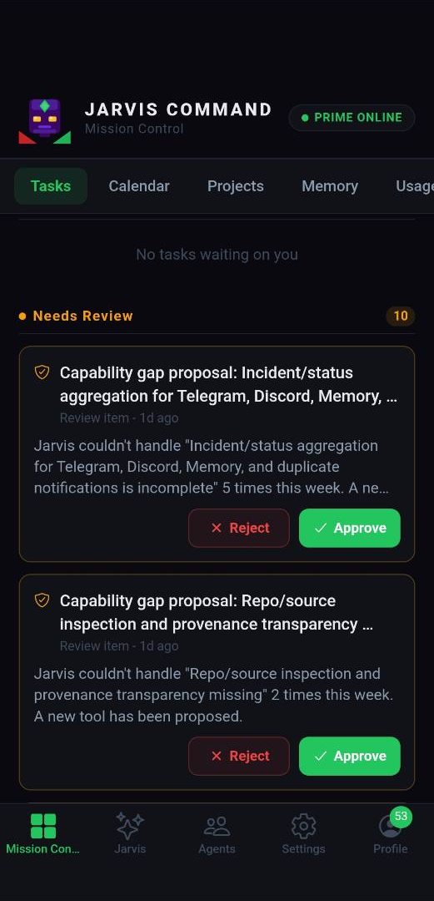
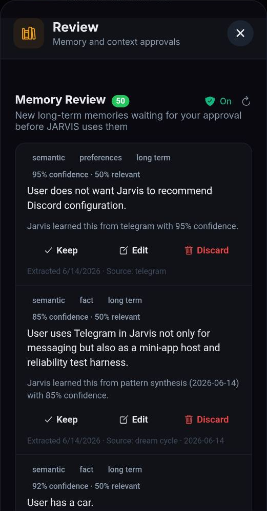
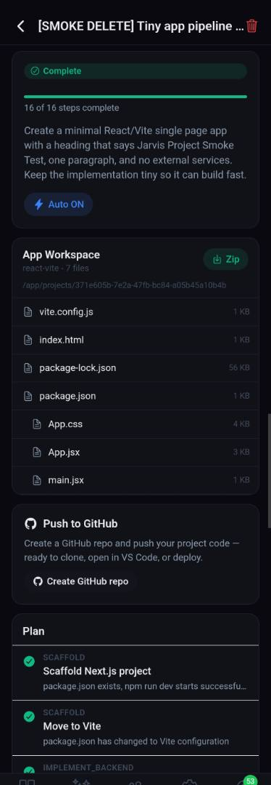
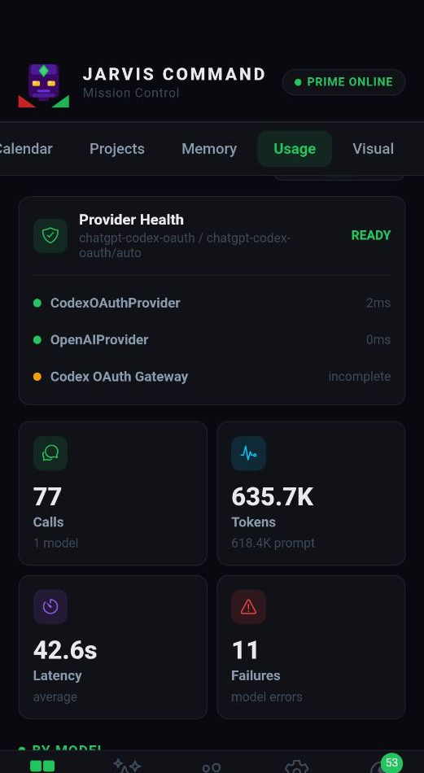
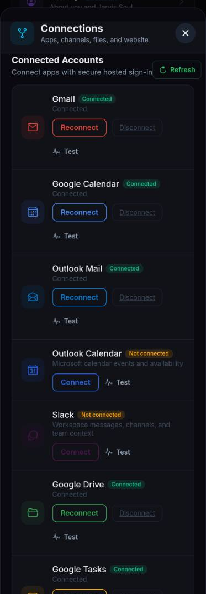
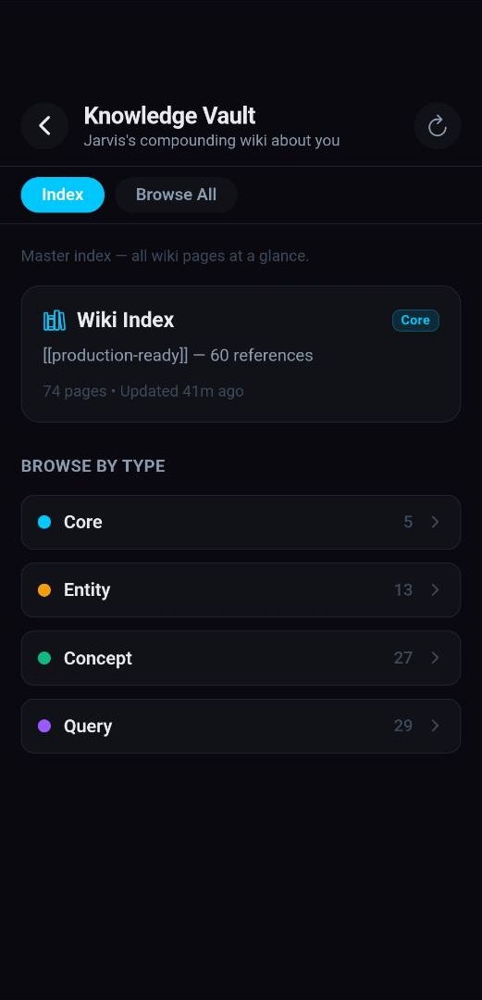
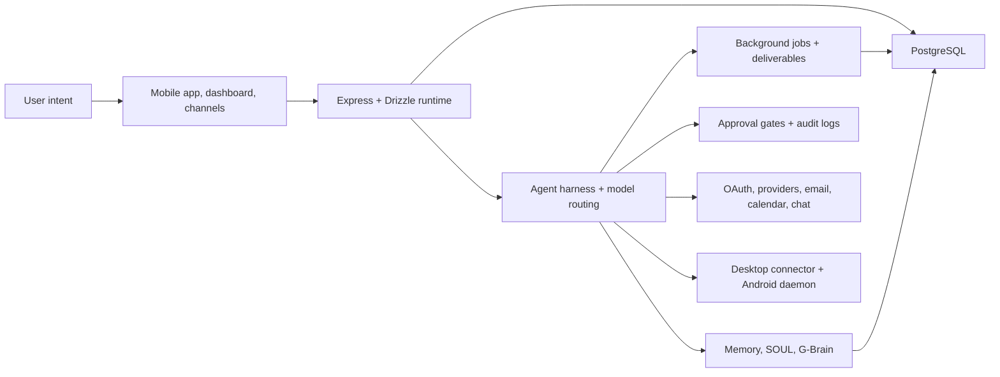

# Jarvis OS

Jarvis OS is a self-hostable personal AI operating system for running a private assistant that can remember, plan, route work across tools and models, and act through connected accounts and devices.

It combines a mobile command center, dashboard surfaces, Express runtime, tool-calling agent harness, long-term memory, background jobs, approval gates, provider routing, and optional desktop/Android connectors into one system.

Jarvis is not a single chatbot wrapper. It is built around an observable operating loop:

```text
user intent -> surfaces/channels -> runtime routing -> context + memory
            -> agent/tool harness -> approval policy -> execution
            -> deliverable/log/result
```

The goal is useful autonomy that stays reviewable. Jarvis can work in the background, but high-risk actions still need explicit approval.

## Screenshots

These public screenshots are cropped from the current mobile/web app surface. They focus on the user-facing operating loop: review queued work, approve real long-term memories, package generated app workspaces, monitor provider health, connect accounts, and inspect the knowledge system that Jarvis builds over time.

| Mission Control | Memory Review | App Workspace |
|---|---|---|
|  |  |  |

| Provider Usage | Connected Accounts | Knowledge Vault |
|---|---|---|
|  |  |  |

## What Jarvis Can Do

- **Personal command center:** Expo mobile/web app plus dashboard surfaces for chat, Mission Control, settings, goals, inbox, memory review, job status, deliverables, and connector setup.
- **Agent runtime:** Tool-calling harness with model routing, provider fallback, task-specific agents, quality checks, controlled background jobs, and visible deliverables.
- **Long-term memory:** Structured memories, people records, SOUL/context files, G-Brain derived notes, memory review, retrieval paths, and provenance-aware personalization.
- **Autonomous work queue:** Persistent jobs for research, deep research, writing, planning, email drafting, goal decomposition, named-agent work, and build-feature workflows.
- **Reviewable outputs:** Approval gates, draft/revise/approve flows, revision lineage, Drive export, channel notifications, and audit-friendly records.
- **Multi-channel presence:** Telegram, Discord, Slack, WhatsApp, in-app chat, web chat, email/calendar integrations, and external notification routing.
- **Provider routing:** OpenAI-compatible providers, Gemini, OpenRouter-style routing, stored provider profiles, and ChatGPT subscription/OAuth routes.
- **Desktop and Android control:** Optional Windows desktop connector plus Android device control for local shell/file operations, screenshots, screen understanding, app navigation, notifications, wake/talk mode, and phone-local model experiments.
- **Safety boundaries:** Approval receipts, tool policies, daemon permissions, forbidden action checks, audit logs, and fail-closed behavior for high-risk actions.
- **Deployment support:** Railway-oriented server deployment, Expo/Android builds, dashboard build, database migrations, doctor checks, and QA scripts.

## Capability Status

| Area | Current status | Required configuration | Verification |
|---|---|---|---|
| Express API and agent runtime | Core runtime is implemented and supported on `main`. | `DATABASE_URL`, `JWT_SECRET`, `APP_BASE_URL`, at least one usable model/provider path. | `npm run server:build`, `npm run jarvis:doctor`, `npm test` |
| Expo mobile/web app | Implemented, with local Expo development and APK build paths. | `EXPO_PUBLIC_DOMAIN` or equivalent hosted API domain; Android/iOS build credentials for signed releases. | `npm run expo:dev`, GitHub APK workflows for releases |
| Dashboard | Implemented as a separate Next.js app on port `3001`. | `JARVIS_API`, `DASHBOARD_SECRET`. | `npm --prefix dashboard run build` |
| Long-term memory and G-Brain | Implemented, with ongoing hardening for review, provenance, and correction flows. | Database tables, model/provider support for embedding or extraction paths where enabled. | `npm test`, memory-specific tests listed in `CONTRIBUTING.md` |
| Background jobs and deliverables | Implemented for queued autonomous work and reviewable outputs. | Database-backed job state and provider credentials for the requested task. | `npm test`, job/runtime tests |
| Approval gates and safety controls | Implemented and treated as security-sensitive. | No extra setup for local checks; production deployments must keep approval gates enabled. | `npm test`, approval/runtime tests |
| Provider routing | Implemented for OpenAI-compatible providers, Gemini, OpenRouter-style routing, and ChatGPT subscription connector paths. | Provider API keys or a working desktop/Codex OAuth connector path. | Provider routing tests listed in `CONTRIBUTING.md` |
| Channels and external accounts | Implemented by adapter, but each channel is optional and requires its own credentials. | Only configure the channels you actually use. | Channel-specific smoke checks and scrubbed logs |
| Desktop and Android connectors | Implemented, optional, and high-risk. | Explicit pairing, narrow file roots, device permissions, APK/connector install. | Connector tests listed in `CONTRIBUTING.md`; manual device checks for releases |
| One-click self-hosting | Not yet one-click. Jarvis is self-hostable, but setup still requires explicit database, provider, auth, and optional channel configuration. | See `docs/self-hosting.md`. | Complete the local quickstart and run the checks above |

## Architecture



Main folders:

```text
app/                 Expo Router mobile/web app
dashboard/           Next.js dashboard and mission-control surface
server/              Express server, auth, runtime, routes, integrations
server/agent/        Agent harness, workers, tools, model routing, approvals
server/channels/     Telegram, Discord, Slack, WhatsApp, webchat, in-app adapters
server/daemon/       Server-side bridge for desktop and Android connectors
server/gateway/      Runtime control plane for status, events, devices, and actions
server/memory/       Memory OS, retrieval, prompt context, derived brain support
shared/              Drizzle schema, shared models, runtime contracts
daemon/              Desktop daemon bridge
desktop-connector/   Packaged desktop connector app
android-daemon/      Android device-control daemon
docs/                Architecture, operations, deployment, and roadmap docs
```

## Start Here

1. **Install prerequisites**
   - Node.js 22.x and npm 10.x
   - PostgreSQL 16+
   - At least one AI provider credential or a working ChatGPT subscription connector path
   - Optional: Railway, Expo/EAS, Android Studio/Gradle, Windows PowerShell

2. **Clone and configure**

   ```bash
   git clone https://github.com/battlesbudz/jarvis-os.git
   cd jarvis-os
   npm install
   cp .env.example .env
   ```

3. **Fill in the minimum `.env` values**
   - `DATABASE_URL`
   - `JWT_SECRET`
   - `APP_BASE_URL`
   - `EXPO_PUBLIC_DOMAIN`
   - at least one provider key or subscription connector path

   For concrete local Postgres, secret-generation, expected ports, and first-run checks, follow [`docs/self-hosting.md`](docs/self-hosting.md).

4. **Prepare the database and start the server**

   ```bash
   npm run db:push
   npm run server:dev
   ```

5. **Start the app and dashboard**

   ```bash
   npm run expo:dev
   ```

   ```bash
   cd dashboard
   npm install
   npm run dev
   ```

6. **Verify the install**

   ```bash
   npm run jarvis:doctor
   npm test
   ```

## Hosting

Jarvis is normally hosted as:

- **Express API/server** on Railway or another Node host
- **PostgreSQL** as the durable database
- **Expo/mobile client** pointed at the public API URL
- **Dashboard** as a separate Next.js app when needed
- **Desktop/Android connectors** paired back to the hosted server through secure pairing flows

Minimum production variables:

- `DATABASE_URL`
- `JWT_SECRET`
- `APP_BASE_URL`
- `EXPO_PUBLIC_DOMAIN`
- at least one AI/provider credential or a working ChatGPT subscription connector path
- channel secrets only for the channels you enable

See [`docs/self-hosting.md`](docs/self-hosting.md), [`docs/railway-setup.md`](docs/railway-setup.md), [`docs/operations/jarvis-os-runbook.md`](docs/operations/jarvis-os-runbook.md), [`downloads/README.md`](downloads/README.md), and [`.env.example`](.env.example).

## Compatibility Note

Jarvis OS was renamed in stages from an earlier internal app identity. Some mobile compatibility identifiers, URL schemes, package IDs, and hosted-domain defaults may still use older values so existing APK installs, OAuth callbacks, and deep links do not break unexpectedly. Public-facing docs and display names should say Jarvis OS. See [`docs/public-compatibility.md`](docs/public-compatibility.md).

## Safety Model

Jarvis is designed for real accounts and real devices, so high-risk actions must stay gated:

- No automatic email sends, purchases, deploys, public posts, or destructive file operations without an approval path.
- Desktop and Android operations require explicit connector pairing and permissions.
- Secrets belong in `.env`, Railway variables, GitHub secrets, or provider secret stores, never in source control.
- Code-writing and self-repair tools must remain reviewable and approval-gated.

## Project Status

Jarvis OS is active software, not a polished one-click SaaS template. Many capabilities are implemented and used, but self-hosters should expect to configure providers, database state, OAuth apps, channel webhooks, and connector permissions.

The public `main` branch is the supported branch. See [`ROADMAP.md`](ROADMAP.md) for the public roadmap and [`JARVIS_ROADMAP.md`](JARVIS_ROADMAP.md) for the detailed technical roadmap.

## Contributing

Bug reports, documentation fixes, tests, and scoped capability improvements are welcome. Read [`CONTRIBUTING.md`](CONTRIBUTING.md) and [`SECURITY.md`](SECURITY.md) before opening a pull request.

## Acknowledgements & Inspirations

Parts of Jarvis OS's memory and knowledge-management architecture are derived from and inspired by GBrain, an open-source project created by Garry Tan. Jarvis extends and adapts those concepts as part of a broader Memory OS architecture focused on personal AI, autonomous workflows, reviewable memory, and cross-device presence.

See [`ACKNOWLEDGEMENTS.md`](ACKNOWLEDGEMENTS.md) for attribution details.

## License

Jarvis OS is distributed under the MIT License. See [`LICENSE`](LICENSE).
